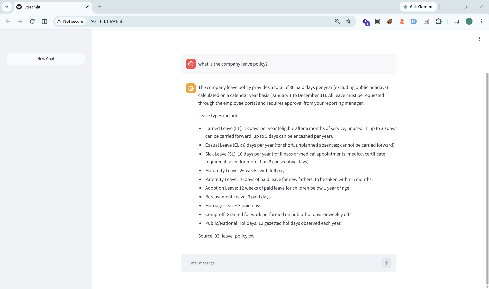

# OmniAssist — Enterprise AI Operations Agent

OmniAssist is a tool-equipped enterprise assistant for **NovaTech Solutions**. It answers employee questions about company policy and carries out workplace tasks such as Google Calendar operations.

It combines a **LangChain / LangGraph** agent, a **hybrid RAG pipeline** (Qdrant dense retrieval + BM25, fused and reranked with Cohere), a **FastAPI** backend, and a **Streamlit** chat client. Answer quality, retrieval quality, and tool selection are measured with a **DeepEval** suite.

> **Demo note.** NovaTech Solutions and the employee policy documents in `app/data/` are fictional and synthetic, created solely for demonstration purposes. They do not describe a real company or real employment terms.

## Why OmniAssist?

Most enterprise chat assistants fail in one of two ways: they answer confidently from general model knowledge, or they hand every question to a single retrieval pipeline and hope the ranking surfaces the right passage. OmniAssist is built around the assumption that real questions arrive on more than one shape.

An employee asking *"how many vacation days do I get, and what is the notice period?"* needs both a grounded answer and an accurate calendar entry. A question like *"what's 15% of 2,400?"* needs no retrieval at all. OmniAssist routes on that distinction: a LangGraph agent inspects each request and selects among policy retrieval, Google Calendar operations, and a calculator, rather than running everything on every turn. Retrieval itself is hybrid — Qdrant for semantic similarity, BM25 for the exact policy terms and numbers that dense vectors tend to blur — then fused and reranked before any answer is written. Every claim is expected to trace back to a retrieved passage, and the evaluation suite exists to hold that line rather than to flatter the system.

The point is not maximal capability. It is showing the routing, grounding, and measurement decisions that make an assistant trustworthy enough to sit inside a company.

---

## Table of Contents

- [Screenshots](#screenshots)
- [Why OmniAssist?](#why-omniassist)
- [Highlights](#highlights)
- [Architecture](#architecture)
- [Tech Stack](#tech-stack)
- [Project Structure](#project-structure)
- [Setup](#setup)
- [Running](#running)
- [API](#api)
- [Evaluation](#evaluation)
- [Security](#security)
- [Known Gaps](#known-gaps)
- [License](#license)

---

## Screenshots



*A policy question asked in the Streamlit client, answered from the retrieved policy corpus. Responses stream token by token, and the answer carries the source filename of the document it was drawn from.*

---

## Highlights

**Answers grounded in policy evidence.** Company-specific answers are grounded in retrieved policy evidence, with source filenames included when available. When the retrieved evidence does not support an answer, the agent is prompted to say so rather than fall back on general model knowledge. Grounding is enforced through system-prompt rules rather than a hard guarantee, so it is validated by the faithfulness metric in the [evaluation suite](#evaluation).

**Hybrid retrieval with reranking.** Dense and sparse retrieval results are fused using reciprocal-rank fusion and reranked with Cohere's reranker, which keeps exact policy values (leave entitlements, currency limits, notice periods) precise.

**Conversational query rewriting.** Follow-ups are rewritten into standalone queries using conversation history, so *"how many days before?"* resolves correctly against the previous turn.

**Calendar actions.** Google Calendar create, read, and update operations are exposed as LangChain tools. Destructive `delete` operations are filtered out when the tool registry is built.

**Provider fallback.** The chat model is wrapped in a fallback chain — Gemini serves every request, and Groq takes over transparently if Gemini times out, rate-limits, or returns a server error. Tool calling works across both providers.

**Layered input protection.** A prompt-injection guard plus three `PIIMiddleware` stages (email redaction, credit-card masking, API-key blocking) run before the model is reached.

**Measured quality.** DeepEval suites score retrieval precision/recall, answer faithfulness/relevancy/correctness, and tool-selection correctness against labelled datasets with pass/fail thresholds. All six metrics currently meet their configured thresholds — see [Results](#results).

**Persistent conversation state.** PostgreSQL checkpointing persists conversation state under a thread ID, allowing a conversation to survive across requests. The chat client supplies a UUID per session and rotates it to begin a new thread.

---

## Architecture

```
                         User  (Streamlit / API)
                                  │
                                  ▼
                     ┌──────────────────────────────┐
                     │  FastAPI · POST /api/v1/chat │
                     │  Security + PII middleware   │
                     │  PostgresSaver checkpointer  │
                     └──────────────┬───────────────┘
                                    ▼
                     ┌──────────────────────────────┐
                     │      LangGraph Agent         │
                     │  decides which tool is       │
                     │  required for this turn      │
                     └──┬────────────┬──────────┬───┘
                        ▼            ▼          ▼
             search_company_    Google      calculator
               policies        Calendar
                        │
                        ▼
              ┌───────────────────────────┐
              │  Query Rewriter (LLM)     │
              │  uses chat history        │
              └─────────────┬─────────────┘
                            ▼
          ┌─────────────────┴─────────────────┐
          ▼                                   ▼
   ┌────────────────┐                 ┌────────────────┐
   │  Qdrant        │                 │  BM25          │
   │  Dense  (k=10) │                 │  Sparse (k=10) │
   └───────┬────────┘                 └───────┬────────┘
           │                                  │
           └───────────────┬──────────────────┘
                           ▼
              ┌───────────────────────────┐
              │  Ensemble / RRF Fusion   │
              │  weights 0.7 / 0.3       │
              └─────────────┬─────────────┘
                            ▼
              ┌───────────────────────────┐
              │  Cohere Reranker         │
              │  rerank-v3.5 → top 5     │
              └─────────────┬─────────────┘
                            ▼
                numbered evidence + sources
                            │
                            ▼
                 Agent → final answer → stream
```

### Request flow

1. `POST /api/v1/chat` validates the payload and maps `user_id` to a conversation thread.
2. Security middleware screens the latest human message; PII middleware redacts or blocks sensitive strings.
3. The agent decides whether a tool is needed — greetings and general knowledge are answered directly.
4. `search_company_policies` rewrites the query against history, retrieves, fuses, reranks, and returns numbered evidence with source metadata.
5. The model answers from that evidence, then `stream_agent` emits the final text token by token. Tool calls and internal output (such as the rewritten query) never reach the user.

### Key modules

| Path | Responsibility |
| --- | --- |
| `app/backend/api/app.py` | FastAPI app, `/` and `/health` endpoints. |
| `app/backend/api/routes.py` | `POST /api/v1/chat` with streamed response. |
| `app/backend/agents/agent.py` | Production agent: model, middleware, checkpointer, `stream_agent()`, `test_agent()`. |
| `app/backend/models.py` | Chat model factory with Gemini → Groq fallback. |
| `app/backend/prompt.py` | System prompts for the agent, rewriter, and generator. |
| `app/backend/config.py` | Models, embeddings, chunking, Qdrant, reranker settings. |
| `app/backend/rag/ingest.py` | Chunks `app/data/*.txt`, embeds into Qdrant, refreshes the BM25 corpus. |
| `app/backend/rag/retriever.py` | Builds the hybrid retriever + reranker; returns cited evidence. |
| `app/backend/rag/query_rewriter.py` | Context-aware query rewriting. |
| `app/backend/rag/rag_tool.py` | `search_company_policies` tool. |
| `app/backend/tools/` | Tool registry and Google Calendar wrapper. |
| `app/backend/evaluation/` | DeepEval datasets and metric suites. |
| `app/frontend/frontend.py` | Streamlit chat client. |

---

## Tech Stack

| Layer | Technology |
| --- | --- |
| Language | Python 3.12 |
| Agent | LangChain 1.3 · LangGraph 1.2 |
| Serving | FastAPI · Uvicorn |
| Frontend | Streamlit · httpx streaming |
| Vector store | Qdrant (`:6333`) |
| Sparse retrieval | BM25 (`rank-bm25`) |
| Reranking | Cohere `rerank-v3.5` (top 5) |
| Embeddings | `sentence-transformers/all-MiniLM-L6-v2` |
| LLMs | Gemini `gemini-3.5-flash-lite` → Groq `openai/gpt-oss-120b` fallback |
| Memory | PostgreSQL via `langgraph-checkpoint-postgres` |
| Integrations | Google Calendar (`langchain-google-community`) |
| Evaluation | DeepEval with Gemini / OpenRouter judges |

---

## Project Structure

```
.
├── app/
│   ├── backend/
│   │   ├── agents/agent.py      # Production LangGraph agent
│   │   ├── api/                 # FastAPI app and /chat route
│   │   ├── rag/                 # Ingest, retriever, rewriter, RAG tool
│   │   ├── tools/               # Tool registry + Calendar wrapper
│   │   ├── evaluation/          # DeepEval datasets and suites
│   │   ├── config.py            # Models, chunking, Qdrant, reranker
│   │   ├── models.py            # Model factory with fallback
│   │   └── prompt.py            # System prompts
│   ├── frontend/frontend.py     # Streamlit chat client
│   └── data/                    # Fictional policy documents (retrieval corpus)
├── requirements.txt             # Pinned Python dependencies
├── .env.example                 # Environment variable template
└── README.md
```

`credentials.json` and `token.json` are local Google Calendar OAuth files and are intentionally excluded from the repository. Supply your own via the OAuth flow described in [Setup](#setup). `bm25_chunks.json`, `test_cases.json`, and `tool_test_cases.json` are generated locally by the ingestion and evaluation suites and are intentionally excluded from the repository as well — rerun those commands to recreate them.

---

## Setup

**Prerequisites:** Python 3.12+, a running Qdrant instance, a PostgreSQL database, and Google Calendar OAuth files (`credentials.json` + `token.json`).

```bash
# 1. Virtual environment
python -m venv venv
venv\Scripts\activate              # Windows
# source venv/bin/activate         # macOS / Linux

# 2. Dependencies
pip install -r requirements.txt
pip install -r app/frontend/requirements.txt

# 3. Qdrant must be reachable at http://localhost:6333 (override with QDRANT_URL)
```

> **Note on fallback.** Both model clients are constructed at import time, so a missing or invalid `GOOGLE_API_KEY` prevents the server from starting. The fallback covers request-time failures only.

### Environment variables

Create `.env` in the repository root — copy `.env.example` and fill in the values.

| Variable | Required | Purpose |
| --- | --- | --- |
| `GOOGLE_API_KEY` | Yes | Gemini model and DeepEval judge. |
| `CO_API_KEY` | Yes | Cohere reranking. |
| `DB_URL` | Yes | PostgreSQL connection string. |
| `GROQ_API_KEY` | Recommended | Groq fallback model, used when Gemini fails at request time. |
| `HF_TOKEN` | Recommended | Hugging Face model downloads. |
| `OPENROUTER_API_KEY` | Optional | Alternative judges in `eval_retriever.py`. |
| `TAVILY_API_KEY` | Optional | Reserved for web search (tool disabled). |
| `QDRANT_URL` | Optional | Override the Qdrant URL from `config.py`. |

### Google Calendar OAuth

`CalendarToolkit` reads its OAuth files from the working directory. Place `credentials.json` at the repository root and start the app once to complete the consent flow, which generates `token.json`. Without these files the calendar tools are unavailable, but the rest of the agent still works.

### Build the knowledge base

Run once after cloning, and again whenever documents in `app/data/` change:

```bash
python -m app.backend.rag.ingest
```

This chunks every `app/data/*.txt`, embeds the chunks into the Qdrant `documents` collection, and rewrites the BM25 corpus. To add a single document without a full rebuild, call `add_new_document("app/data/<file>.txt")` from `app/backend/rag/ingest.py`. Restart the backend afterwards so the retriever picks up the refreshed corpus.

---

## Running

**Backend** (required by the frontend):

```bash
uvicorn app.backend.api.app:app --host 0.0.0.0 --port 8000 --reload
```

**Streamlit client:**

```bash
streamlit run app/frontend/frontend.py
```

The client targets `http://127.0.0.1:8000` (`API_URL` in `app/frontend/frontend.py`). Each browser session gets a UUID used as `user_id`; the **New Chat** button rotates it to begin a fresh thread.

---

## API

### `POST /api/v1/chat`

| Field | Type | Constraints |
| --- | --- | --- |
| `query` | string | required, 1–2000 characters |
| `user_id` | string | required, 1–500 characters; maps to the checkpoint thread |

```bash
curl -N -X POST http://127.0.0.1:8000/api/v1/chat \
  -H "Content-Type: application/json" \
  -d '{"query": "How many days of earned leave do I get?", "user_id": "user-1"}'
```

Returns `200` with `text/plain`, streamed token by token:

```text
You get 18 days of earned leave per year.

Source: 02_leave_policy.txt
```

Health checks: `GET /` and `GET /health`. Interactive docs at `/docs`.

---

## Evaluation

Each suite separates **dataset construction** (runs the live agent or retriever and writes a JSON snapshot) from **scoring** (replays that snapshot), so a run can be re-judged without re-running the agent.

```bash
# Retrieval quality — contextual precision and recall 
python -m app.backend.evaluation.eval_retriever

# Answer generation — capture agent output into test_cases.json
python -c "from app.backend.evaluation.rag_evaluation import build_test_cases; build_test_cases()"
# then score: faithfulness , relevancy , correctness 
python -m app.backend.evaluation.rag_evaluation

# Tool selection — capture calls into tool_test_cases.json
python -c "from app.backend.evaluation.tool_selection import build_test_case; build_test_case()"
# then score: tool correctness 
python -m app.backend.evaluation.tool_selection
```

Labels live in `eval_dataset.py` (RAG cases) and `tool_eval_dataset.py` (tool routing). `build_test_case()` appends to `tool_test_cases.json` rather than overwriting it — delete the file first for a clean run.

### Results

| Metric | Score | Threshold | Verdict |
| --- | --- | --- | --- |
| Contextual Recall | **1.00** | 0.90 | Pass |
| Contextual Precision | **0.80** | 0.80 | Pass |
| Answer Relevancy | **0.967** | 0.85 | Pass |
| Faithfulness | **0.90** | 0.85 | Pass |
| Answer Correctness (`GEval`) | **0.97** | 0.90 | Pass |
| Tool Correctness | **1.00** | 0.90 | Pass |

On the current evaluation dataset, contextual recall and tool correctness both scored 1.00: every expected retrieval case in the current labelled evaluation set met the evaluator's recall criterion, and the agent selected the expected tools across routing cases, including multi-tool and no-tool (chitchat) prompts. Given the size of the labelled set, these should be read as "no observed failures" rather than a general guarantee.

Faithfulness at 0.90 is the tightest margin — the agent stays grounded in retrieved evidence, with a small amount of answer phrasing the judge does not trace directly to a cited passage. Contextual precision sits exactly at its threshold, meaning retrieved chunks are relevant but the reranked set is not yet tight enough to clear it with headroom. Both are the highest-value targets for further tuning.

---

## Security

- **Prompt-injection guard** — requests matching override or system-prompt-extraction patterns are rejected before the model runs.
- **PII handling** — emails redacted, credit cards masked, API keys blocked.
- **Grounding** — the agent is prompted to base company-specific claims on retrieved evidence and to abstain when evidence is insufficient.
- **Retrieval opacity** — the agent is instructed never to expose rewritten queries, chunk IDs, scores, or internal tool names.
- **Employee privacy** — system-prompt rules prohibit disclosure of another employee's compensation, benefits, attendance, performance, or calendar.
- **Sandboxed arithmetic** — the `calculator` tool evaluates a restricted AST allow-list instead of `eval`; attribute access, imports, and unknown calls are rejected.
- **Destructive-action control** — calendar `delete` operations are excluded from the tool registry.

`.env`, `credentials.json`, and `token.json` are excluded from version control. Never commit production credentials or OAuth tokens.

---

## Known Gaps

- `/api/v1/chat` has no authentication or rate limiting; any caller can query as any `user_id`. Add auth and bind `user_id` to an authenticated identity before exposing it beyond a trusted network.
- `PostgresSaver` is entered at import time and never released, which complicates graceful shutdown and multi-worker deployments.
- Evaluation coverage is narrow, and most tool-routing cases in `tool_eval_dataset.py` are still commented out.
- LLM-as-judge metrics are evaluator-dependent and should be interpreted alongside the labelled examples and regression tests rather than treated as absolute measurements.

---

## License

No license is specified for this repository. All rights reserved.